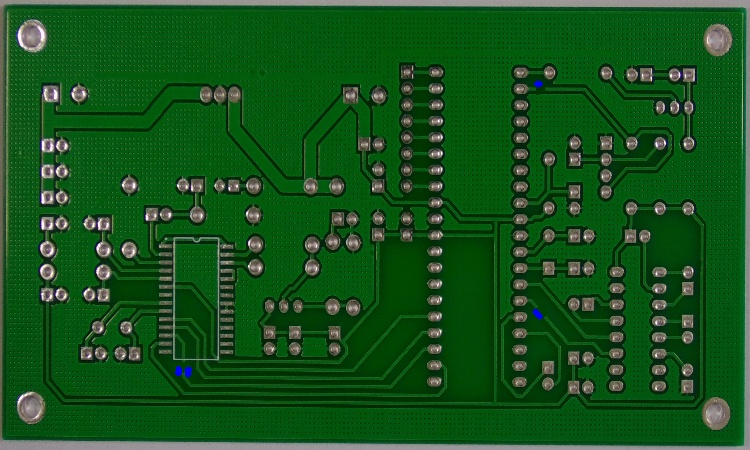

# PCB Defect Detection

## Introduction
This project implements the detection of bare PCB defects such as missing hole, mouse bite and open circuit, using the OpenCV library in Python. 
  The image processing technique called Image Subtraction is used for the purpose of defect detection.

## Dataset
The dataset folder contains the dataset used for this project, and its details in a README file inside the folders of template and defective PCB images. 

#### Template image:
It contains RGB images of five types of bare PCBs. Each of these have been rotated in 3 ways; left, right and 180 degrees(mirror image of original).
Thus, the total number of template images is 20.

#### Test image:
It contains three sub-folders with images for three different defects, namely Missing hole, Mouse bite, Open circuit.
Each folder has the defective images for the five PCB types, and each of these have been rotated in 3 ways; left, right and 180 degrees(mirror image of original).

The number of defective images is as follows:
- Missing hole -> 55 (original) * 4 (rotations) = 220
- Mouse bite -> 55 (original) * 4 (rotations) = 220
- Open circuit -> 56 (original) * 4 (rotations) = 224

Thus, the total number of defective images is 664.

## Code
### 1. main.py
This has the code for main processing of the PCB defect detection, including template matching、image subtraction and contour detection.

### 2.pcb_defect_detection_with_opencv.ipynb
This notebook has the code for the step-by-step PCB defect detection process using image subtraction. The steps, which apply to both template and test images, involve converting the original image to grayscale, applying Gaussian blur to blur the image and then using adaptive thresholding to convert the image to a binary image. 
  Once both the images are binary, the test image is subtracted from template to get the resultant image (difference image) which shows the defects. 
  Contour detection is then used to get the number of defects in the final image.

An example of a final result image showing defects looks like this:

